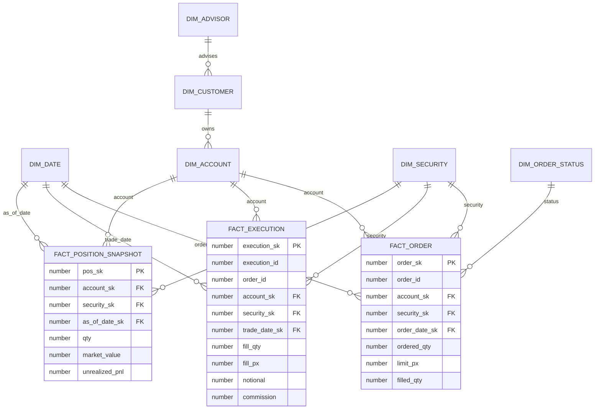

# Snowflake MART ER — Star Schema

```mermaid
erDiagram
    DIM_DATE ||--o{ FACT_ORDER : order_date
    DIM_DATE ||--o{ FACT_EXECUTION : trade_date
    DIM_DATE ||--o{ FACT_POSITION_SNAPSHOT : as_of_date
    DIM_ACCOUNT ||--o{ FACT_ORDER : account
    DIM_ACCOUNT ||--o{ FACT_EXECUTION : account
    DIM_ACCOUNT ||--o{ FACT_POSITION_SNAPSHOT : account
    DIM_CUSTOMER ||--o{ DIM_ACCOUNT : owns
    DIM_ADVISOR ||--o{ DIM_CUSTOMER : advises
    DIM_SECURITY ||--o{ FACT_ORDER : security
    DIM_SECURITY ||--o{ FACT_EXECUTION : security
    DIM_SECURITY ||--o{ FACT_POSITION_SNAPSHOT : security
    DIM_ORDER_STATUS ||--o{ FACT_ORDER : status

    FACT_ORDER {
        number order_sk PK
        number order_id
        number account_sk FK
        number security_sk FK
        number order_date_sk FK
        number ordered_qty
        number limit_px
        number filled_qty
    }
    FACT_EXECUTION {
        number execution_sk PK
        number execution_id
        number order_id
        number account_sk FK
        number security_sk FK
        number trade_date_sk FK
        number fill_qty
        number fill_px
        number notional
        number commission
    }
    FACT_POSITION_SNAPSHOT {
        number pos_sk PK
        number account_sk FK
        number security_sk FK
        number as_of_date_sk FK
        number qty
        number market_value
        number unrealized_pnl
    }
```
