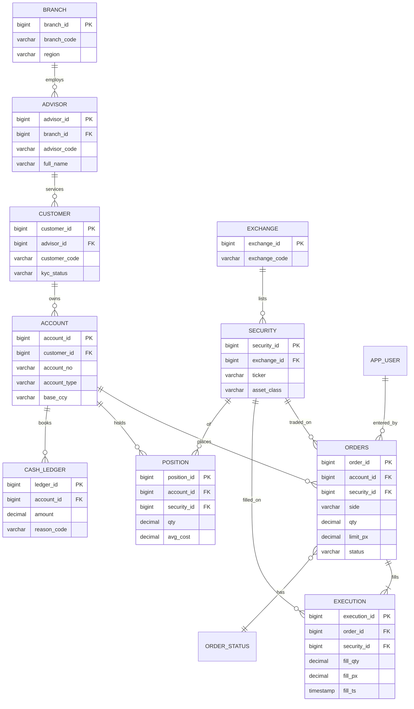

# OLTP ER — Order Management System

```mermaid
erDiagram
    BRANCH ||--o{ ADVISOR : employs
    ADVISOR ||--o{ CUSTOMER : services
    CUSTOMER ||--o{ ACCOUNT : owns
    ACCOUNT ||--o{ ORDERS : places
    ACCOUNT ||--o{ POSITION : holds
    ACCOUNT ||--o{ CASH_LEDGER : books
    SECURITY ||--o{ ORDERS : traded_on
    SECURITY ||--o{ EXECUTION : filled_on
    SECURITY ||--o{ POSITION : of
    EXCHANGE ||--o{ SECURITY : lists
    ORDERS ||--|{ EXECUTION : fills
    ORDERS }o--|| ORDER_STATUS : has
    APP_USER ||--o{ ORDERS : entered_by

    BRANCH {
        bigint branch_id PK
        varchar branch_code
        varchar region
    }
    ADVISOR {
        bigint advisor_id PK
        bigint branch_id FK
        varchar advisor_code
        varchar full_name
    }
    CUSTOMER {
        bigint customer_id PK
        bigint advisor_id FK
        varchar customer_code
        varchar kyc_status
    }
    ACCOUNT {
        bigint account_id PK
        bigint customer_id FK
        varchar account_no
        varchar account_type
        varchar base_ccy
    }
    SECURITY {
        bigint security_id PK
        bigint exchange_id FK
        varchar ticker
        varchar asset_class
    }
    EXCHANGE {
        bigint exchange_id PK
        varchar exchange_code
    }
    ORDERS {
        bigint order_id PK
        bigint account_id FK
        bigint security_id FK
        varchar side
        decimal qty
        decimal limit_px
        varchar status
    }
    EXECUTION {
        bigint execution_id PK
        bigint order_id FK
        bigint security_id FK
        decimal fill_qty
        decimal fill_px
        timestamp fill_ts
    }
    POSITION {
        bigint position_id PK
        bigint account_id FK
        bigint security_id FK
        decimal qty
        decimal avg_cost
    }
    CASH_LEDGER {
        bigint ledger_id PK
        bigint account_id FK
        decimal amount
        varchar reason_code
    }
```
